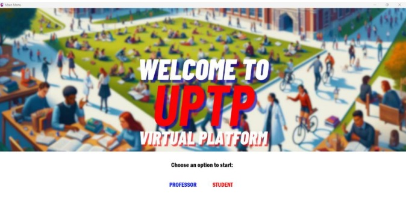

# UPTP Virtual

**UPTP Virtual** is a comprehensive educational management platform engineered for the **Universidad Politécnica Taiwán Paraguay (UPTP)**. The system replicates core academic functionalities found in institutional platforms such as Canvas or Sapientia, providing an integrated environment for students and faculty to manage academic schedules and performance records via a C++ architecture.

## System Interfaces

### Primary Graphical User Interface

## Core Functionalities

* **Role-Based Access Control:** Dedicated interface modules for Student and Faculty user types.
* **Authentication System:** Secure registration and login protocols utilizing local data persistence.
* **Dynamic Scheduling:** A structured interface designed to track courses, classroom assignments, and faculty timetables.
* **Academic Grade Management:** A systematic framework for the input, storage, and retrieval of academic evaluations.
* **File-Based Data Persistence:** Implementation of `.txt` file handling to ensure consistent data state across application sessions.

## Technical Specifications

* **Language:** C++
* **Integrated Development Environment:** RAD Studio 12 (Embarcadero)
* **UI Framework:** FireMonkey (FMX)
* **Computational Logic:** Advanced implementation of Data Structures (Linked Lists, Vectors) and File Stream Handling (fstream).

## Implementation Instructions

1. **Repository Acquisition:** Clone the repository to a local directory.
2. **Environment Setup:** Open the project file (`.cbproj`) within the **RAD Studio 12** environment.
3. **Dependency Configuration:** Ensure the data source file `test.txt` is located within the executable's root directory.
4. **Compilation:** Execute the Build command and Run (F9).

> **Technical Note:** Manual source code execution requires the verification of local file paths within the `fstream` function calls to ensure proper directory mapping.

## Repository Structure

* **/src**: Implementation source code and header files.
* **/docs**: Comprehensive project documentation and technical reports.
* **/assets**: Graphical resources and interface screenshots.

## Project Origin

Developed as part of the academic curriculum for the Second Year of Engineering at the Universidad Politécnica Taiwán Paraguay.

---
